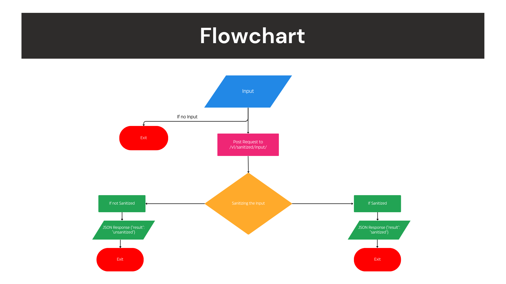

# Sai Chandran Assessment

This project implements a Flask API endpoint to detect SQL injection characters in input strings.

## Approach

### Flowchart Overview



## Installation

1. Clone the repository:

   ```bash
   git clone https://github.com/RJ-SaiChandran/Python-Assessment.git
   cd "Python-Assessment"
   ```

2. Install dependecies:
   ```
   pip install -r requirements.txt
   ```
## Usage
### Testing with Postman

You can use Postman to easily test the Flask API endpoints. Follow these steps to test the API using Postman:

1. **Download and Install Postman**: [download Postman](https://www.postman.com/downloads/) and install it on your machine.

2. **Start the Flask Application**: Ensure your Flask application is running locally. If not, start it using:

   ```bash
   python main.py
   ```

3.  Set Up Postman Environment (Optional): Set up a Postman environment to store variables like base_url (http://localhost:5000 by default).

4. Send POST Request to API Endpoint:

    * Endpoint: `{{base_url}}/v1/sanitized/input/`

    * Method: POST

    * Headers:

        * `Content-Type: application/json`
    * Body: Select the "raw" option and choose "JSON" from the dropdown. Paste the input JSON payload:
    ```
    {
        "input": "some input"
    }
    ```
5. Send the Request: Click on the "Send" button in Postman to send the POST request.

6. Review the Response: Check the response in Postman to verify if the input was classified as `sanitized` or `unsanitized`.

## API Endpoint Details

The API endpoint `/v1/sanitized/input/` is designed to receive a JSON payload with an `input` field. The endpoint checks the input string for any SQL injection characters and returns a JSON response indicating whether the input is deemed "sanitized" or "unsanitized".

- **Input Criteria**:
  - **Sanitized Input**: The input is classified as "sanitized" if it does not contain any known SQL injection characters.
  - **Unsanitized Input**: If the input contains any SQL injection characters, it is classified as "unsanitized".

This classification is based on a basic set of SQL injection detection rules implemented within the API.


# Conclusion

Thank You for reviewing the project.

* Email: rjsaichandran@gmail.com.
#
